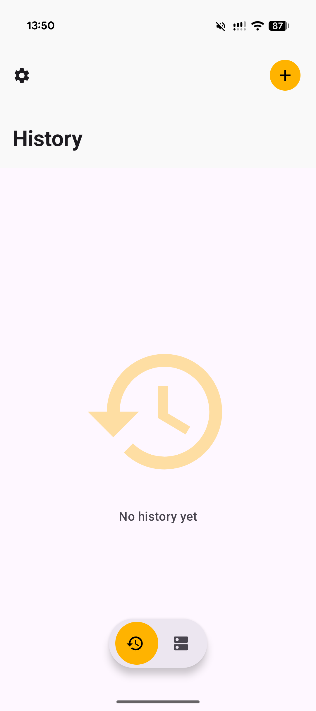
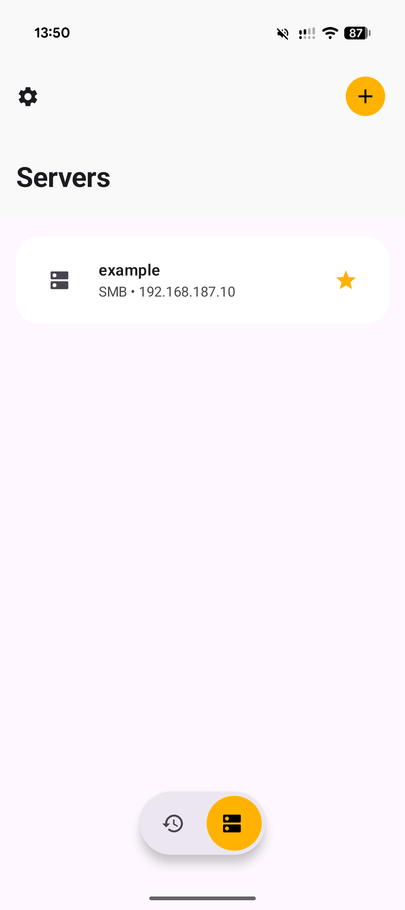
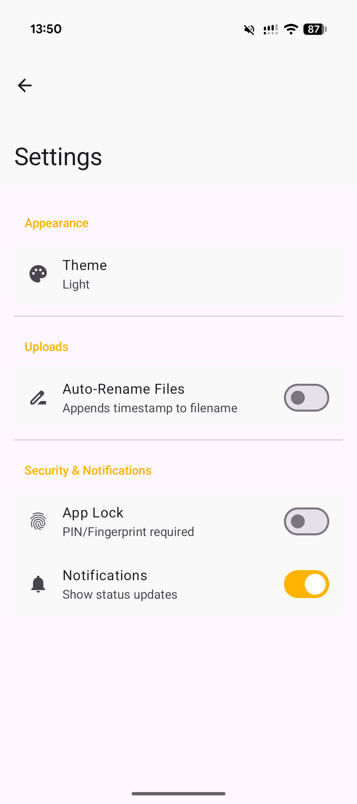

# ⚡ Zack - Network Storage Drop

# Zack
**Zack** is the fastest, most lightweight way to beam photos, documents, and videos from your Android device directly to your home server, NAS, or PC. 
No cables, no cloud delays, no privacy concerns. Just **Zack!**

  
  
  

## ✨ Features

- 🚀 **Zack Upload:** Instant file sharing from any app via the Android Share Menu or internal file picker.
- 🛡️ **Privacy Focused:** Direct SMB transfers within your local network. No external servers, no tracking, no middlemen.
- 🔒 **Biometric Security:** Protect your server configurations and transfer history with Fingerprint or Face Scan (App Lock).
- ⚡ **Modern Design:** - **Symmetric UI:** Innovative "Top-Right Action" button combined with a perfectly centered "Bottom Navigation Pill".
    - **Gliding Navigation:** Smoothly switch between History and Server lists with animated transitions.
    - **Glassmorphism:** A dynamic lightning bolt icon with modern mesh gradients.
- 📊 **Smart History:** Keep track of your uploads with a visual log. Failed uploads are highlighted, and active ones show live progress.
- 🌓 **Theme Support:** Choose between Light, Dark, and a true AMOLED Black mode to save battery and look sharp.
- 🔔 **Notification Sync:** Optional status updates for your background uploads, so you know when it's done.

## 🛠️ Technical Stack

- **UI:** Jetpack Compose with Material 3
- **Architecture:** Room Database with KSP, WorkManager for background tasks
- **Protocol:** SMBJ for high-performance network storage communication
- **Security:** AndroidX Biometric & EncryptedSharedPreferences

## 🚀 How it works

1. **Configure:** Add your NAS or Windows Share once.
2. **Select:** Open any file or gallery image on your phone.
3. **Share:** Hit "Share" and pick **Zack**.
**Done. Zack!**

---

Made with ❤️ for speed and privacy.

